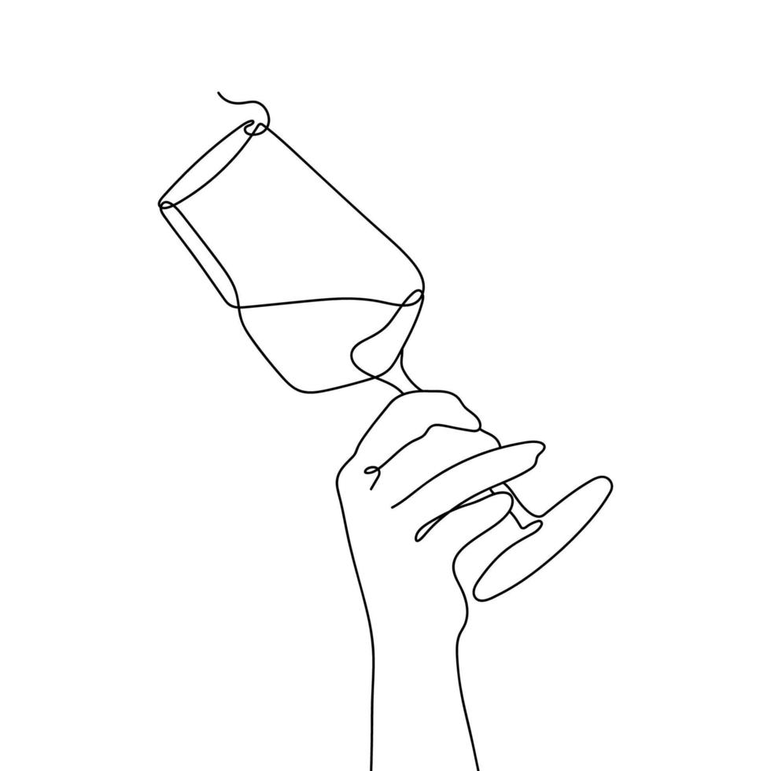

<a href="#especiales" style="text-decoration: none; color: black; cursor: pointer; border-bottom: 1px solid; width: fit-content;">Platos del día</a>
<a href="#entradas" style="text-decoration: none; color: black; cursor: pointer; border-bottom: 1px solid; width: fit-content;">Entradas</a>
<a href="#principales" style="text-decoration: none; color: black; cursor: pointer; border-bottom: 1px solid; width: fit-content;">Principales</a>
<a href="#bebidas" style="text-decoration: none; color: black; cursor: pointer; border-bottom: 1px solid; width: fit-content;">Bebidas</a>
<a href="#postres" style="text-decoration: none; color: black; cursor: pointer; border-bottom: 1px solid; width: fit-content;">Postres</a>
<a href="#vinos" style="text-decoration: none; color: black; cursor: pointer; border-bottom: 1px solid; width: fit-content;">Vinos</a>

Lo de Juanjo
=============

 Platos del día: 
 ----------

 - *Caponata siciliana* <small>(entrada)</small> | $1100
 - *Mousse de atún con ensalada verde* <small>(entrada)</small> | $1100
 - *Pollo al champigñon con papas* | $1700

---

 Entradas: 
 ---------

 **Frías:**

 -   *Bruschetta de berenjena* <small>(Focaccia, jamón crudo, berenjena y rúcula)</small> | $1500
 -  *Mozzarella tibia* <small>(con jamón crudo y hojas verdes)</small> | $1700
 -  *Paté a la naranja* <small>(con ensalada cítrica)</small> | $1500

 **Calientes:**

 -  *Empanada de carne* | $400
 -  *Filete de pollo al estilo thai* <small>(con guacamole)</small> | $1700
 -  *Milanesa de mozzarella* | $1500
 -  *Salchichas Franckfurt* <small>(con ensalada de papas)</small> | $1500
 -  *Polenta grillada con hongos provenzal* | $1800

---

==============================================================================

<h1 class="si-print">Lo de Juanjo</h1>

 Principales: 
 ------------

 **Minutas:**

 -  *Milanesa con papas fritas* | $1800
 -  *Suprema con papas fritas* | $1900

 **Pastas:** 

 -  *Crepes de verdura y ricotta* <small>(con salsa parisienne)</small> | $1900
 -  *Sorrentinos de jamón y queso* <small>(con salsa crema de espinaca)</small> | $1900
 -  *Tallarines de espinaca* <small>(con salsa crema de pollo al curry)</small> | $1900

 **Carnes:** 

 -  *Bife de chorizo* <small>(con papas a la provenzal y salsa criolla)</small> | $3100
 -  *Carré Tex-Mex* | $2600
 -  *Lomo al marsala* <small>(con risotto de calabaza y roquefort)</small> | $3100
 -  *Mollejas* <small>(con papas rosti, ensalada de rúcula y vinagreta de mostaza y miel)</small> | $3100
 -  *Pollo con salsa de verdeo, morrones y hongos* <small>(con papas españolas)</small> | $2200
 -  *Salmón rosado con arroz y vegetales* <small>(con salsa de eneldo)</small> | $5500

---

==============================================================================

<h1 class="si-print">Lo de Juanjo</h1>

 Bebidas: 
 --------

 **Gaseosas:** 
 
 - *Botella de 1,5lts* <small>(Línea Coca-Cola)</small> | $850
 - *Botella de 1lt* <small>(Línea Coca-Cola)</small> | $500
 - *Botella de 500cc* <small>(Línea Coca-Cola)</small> | $400

 **Agua:**
 
 - *Botella de 500cc* <small>(sin gas)</small> | $250
 - *Botella de 500cc* <small>(con gas)</small> | $280
 - *Botella de 2lts* | $330
 - *Levité de 500cc* <small>(pomelo, naranja, manzana, ananá)</small> | $380
 - *Levité de 1,5lts* <small>(pomelo, naranja, manzana, ananá)</small> | $520
 - *Sifón de 1lt* | $400

 **Cervezas:**
 
 - *Amstel de 1lt* | $1200
 - *Heineken de 1lt* | $1800
 - *Imperial de 1lt* | $1300
 - *Heineken lata de 355cc sin alcohol* | $660

 **Champañas:**
 
 - *Chandón de 375cc* | $2000
 - *Chandón de 750cc* | $3600
 - *Chandón Rosé de 750cc* | $3600

 **Sidras:**
 
 - *Sidra 1888 de 750cc* | $2900
 - *Sidra 1888 Rosé de 750cc* | $2900

---

=================================================================

<h1 class="si-print">Lo de Juanjo</h1>

 Postres: 
 --------

 -  *Brownie noche y día* <small>(con dos cremosos de chocolate blanco y negro)</small> | $1000
 -  *Curd de maracuyá* <small>(con merenguitos de limón, chantilly y frutos rojos)</small> | $900
 -  *Espuma de limón* <small>(con frutos rojos)</small> | $800
 -  *Flan casero* | $550
 -  *Marquise de chocolate* <small>(con helado de maracuyá)</small> | $1000
 -  *Mouse de mandarina* <small>(con crocante de coco)</small> | $800
 -  *Mouse de sambayón* <small>(con chantilly, frutos rojos y nueces)</small> | $800
 -  *Omelette de norvégiene* <small>(helado de americana cubierto de merengue horneado)</small> | $1000
 -  *Panqueques de manzana al ron* | $800
 -  *Parfait de whisky* <small>(crema con praliné de frutos rojos)</small> | $800
 -  *Volcán de chocolate* <small>(con helado de americana)</small> | $1000

---

=================================================================

<h1 class="si-print">Lo de Juanjo</h1>

 Vinos: 
 -----

 **Bodega ESMERALDA**

 - *ESTIBA MALBEC 750cc* | $1300
 - *ESTIBA MALBEC 375cc* | $1300
 - *ESTIBA CHARDONNAY 750cc* | $1300
 - *ESMERALDA MALBEC 750cc* | $2200
 - *ESMERALDA CABERNET 750cc* | $2200
 - *ESMERALDA RED BLEND 750cc* | $2200
 - *ESMERALDA CHARDONNAY 750cc* | $2200

 **Bodega UXMAL**

 - *UXMAL CABERNET/MALBEC 750cc* | $1600
 - *UXMAL MALBEC 750cc* | $1600
 - *UXMAL MALBEC 375cc* | $1100
 - *UXMAL CABERNET 750cc* | $1600
 - *UXMAL CHARDONNAY 750cc* | $1600

 **Bodega ALAMOS**

 - *ALAMOS MALBEC 750cc* | $3500
 - *ALAMOS MALBEC 375cc* | $2000
 - *ALAMOS RESERVE MALBEC 750cc* | $4000
 - *ALAMOS CHARDONNAY 750cc* | $3200

 **Bodega CATENA ZAPATA**

 - *NICASIA RED BLEND MALBEC 750cc* | $4200
 - *NICASIA RED BLEND CABERNET FRANC 750cc* | $4200
 - *DV CATENA MALBEC/CABERNAC 750cc* | $6500
 - *DV CATENA CHARDONNAY 750cc* | $6500
 - *DV CATENA MALBEC/MALBEC 750cc* | $10200
 - *DV ANGELICA CATENA ZAPATA MALBEC 750cc* | $14000

---

===

<h1 class="si-print">Lo de Juanjo</h1>

 **Bodega RUTINI**

 - *TRUMPETER MALBEC 750cc* | $3800
 - *TRUMPETER SYRAH 750cc* | $3800
 - *TRUMPETER CABERNET SAUVIGNON 750cc* | $3900
 - *RUTINI CABERNET/SYRAH 750cc* | $6400
 - *RUTINI CABERNET/MERLOT 750cc* | $6400
 - *RUTINI CABERNET/MALBEC 750cc* | $6400
 - *RUTINI MALBEC 750cc* | $10500
 - *RUTINI CABERNET 750cc* | $10500

---

     

===

<h1 class="si-print">Lo de Juanjo</h1>

 **Bodega TRAPICHE**

 - *TRAPICHE MALBEC 750cc* | $1800
 - *TRAPICHE CABERNET/SAUVIGNON 750cc* | $1800
 - *TRAPICHE SAUVIGNON BLANCO 750cc* | $1800
 - *TRAPICHE DULCE COCECHA 750cc* | $1800
 - *TRAPICHE DULCE COCECHA ROSADO 750cc* | $1800
 - *FOND DE CAVE MALBEC 750cc* | $3200
 - *FOND DE CAVE CABERNET 750cc* | $3200

---

     

===

<h1 class="si-print">Lo de Juanjo</h1>

 **Bodega LÓPEZ**

 - *LÓPEZ MALBEC 750cc* | $1800
 - *LÓPEZ BLANCO 750cc* | $1800
 - *LÓPEZ CABERNET SAUVIGNON 750cc* | $1800
 - *LÓPEZ MALBEC 375cc* | $1500
 - *LÓPEZ BLANCO 375cc* | $1400

---

    

===

  <footer class="no-print">
  <small><a href="https://ezequielcolungaacha.com/" target="_blank" style="text-decoration: none; color: black; cursor: pointer;">Lo de Juanjo @ 2023 | Menú QR hecho por Ezequiel Colunga Acha</a></small>
  </footer>